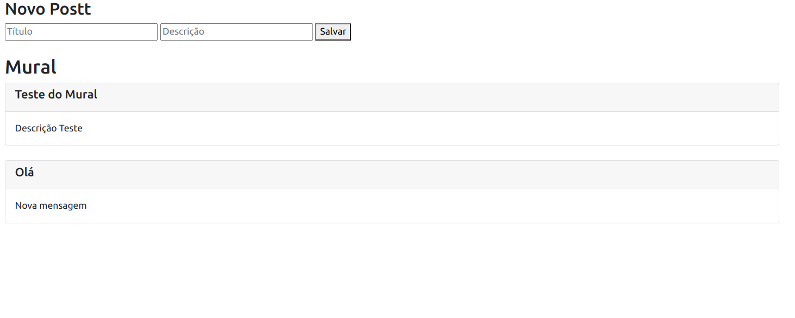

# Mural de Avisos ✏️

<h1>
  
</h1>

## 🚀 About

This Mural was created for studying more about Nodejs and API's. You can add a Title and a Description on the mural. Front-end consumes the API to display the information.

### 📋 Precondition

This project needs NodeJS. If you do not have it installed, just follow [THIS](https://nodejs.org) link and install the LTS version.

### 👨‍💻 How to Setup

```bash
  # Clone the project
  $ git clone https://github.com/Levis44/Mural-de-Avisos.git
```

To execute the project, just run this code this commands:
```sh
  $ cd Mural-de-Avisos # acces the folder 
  $ npm init -y # inicialize the package.json
  $ npm install express body-parser cors # installing express, body parser and cors
  $ node index.js # running the node server
```

## 🛠️ Tools

* [NodeJS](https://nodejs.org) 
* [HTML](https://html5.org/) 
* [JS](https://js.org/) 

## 📝 License

This project is under the MIT license. See the file [LICENSE.md](LICENSE) for more details.

---

<p align="center">Done by Levi Bernardelli Ciarrocchi ✌🏼</p>
